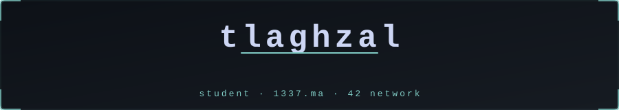

  

<h1 align="center">tlaghzal</h1>

  Systems Programming Student @ 1337 (42 Network) • C • Linux/POSIX • Low-Level Engineering

  
  
  
  

## About

I build low-level software with focus on memory safety, performance, and clean architecture.

- Build robust C projects from scratch.
- Work daily in Linux/POSIX environments.
- Debug and validate with `gdb`, `valgrind`, and disciplined testing.
